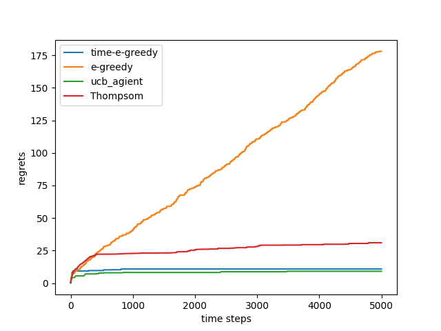
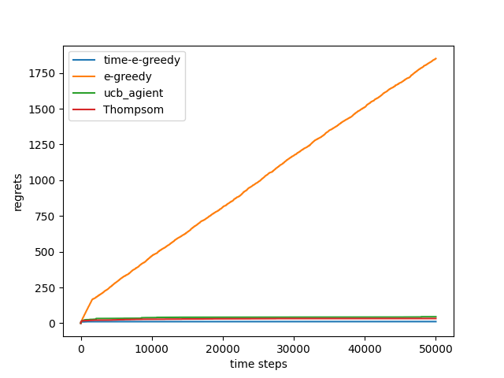
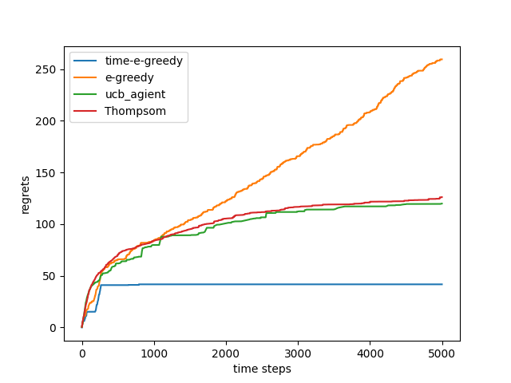
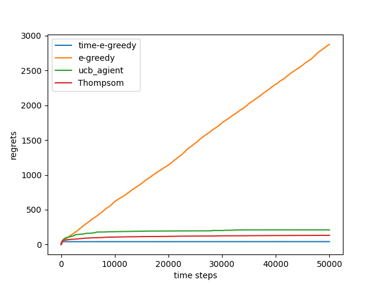

# 强化学习

## 1. 强化学习

### 1.1 简介

#### 1.1.1 分类

通过数据预测概率分布：

​	根据数据进行预测-有监督学习，生成数据实例- 无监督学习

​	都是进行数据分布的预测

决策类型

>  环境中采取行动（RL）行动延伸到环境中会产生改变。
    >> 转换到新的状态
    >> 随着时间推移，不断的累计奖励

#### 1.1.2 基础概念 
三个方面

感知：在某种程度上感知环境状态。
行动：可以采取行动来影响状态或者达到目标，采取一定的策略。
目标：随着时间退役最大化积累奖励，奖励就是每一次的即使反馈信号。

#### 1.1.3 系统要素

历史：观察，行动和奖励的序列

* 状态：一种用于确定接下来会发生事情的奖励
$ s_t = f(H_t) $
状态是关于历史的函数：全局中，所有对象的状态，驱使整个环境继续进行

* 决策(policy):智能体看到什么样的环境应该采取什么行为
    * 从状态到行动的映射
    * 分类
        > 确定性映射 $a= pi(a)$,是一个实打实的函数
        > 随机策略:根据当前s产生关于a的distribution,他是一个条件分布 
* 奖励函数
    > 一个定义强化学习目标的函数,立即知道什么是好的,什么是不好的
* 价值函数;对于奖励的累计，核心也抽象
    > 对于未来的奖励和估计,对于S_t,他的reword也服从一定的分布,由于一系列不确定性,(环境,决策,reword)
    > 通过累加进行对比,然后得到最后的状态,进行对比.和单步的reword没太大关系,和未来有关

#### 1.1.5 智能体分类

* 基于模型的强化学习
> 策略价值函数 
> 环境模型,产生数据相关

* 模型无关
> 更加真实的强化学习模型.我们不可能知道真正的强化学习是什么样子的并且还能建立起来相关模型
> 没有环境模型
> Atari游戏模型,更难,需要采集更大的数据

> 基于价值
    > 没有策略V(s),Q(s,a),π(S)
> 基于策略
    > 已知π(s),反向的到Q,V(梯度上升)
> Actor-Critic
    > 基于策略和价值,相辅相成

## 2.探索和利用
### 2.1 基本问题
* explotation 执行能够获得已知最有收益的决策
* exploration 尝试更多可能的决策，不一定是最有收益

探索是获得有可能的最好结果的关系

### 2.2 策略探索的一些原则
朴素方法，添加策略噪声，积极初始化，基于不确定性的量度，如果有很大不确定性，可能会带来更大的收益

概率匹配
* 基于每一个动作的回报，去选择回报最大的动作

* 状态搜索
    * 探索棋盘一些可以带来更高收益的策略

### 2.3 多臂老虎机
* 去优化累计时间的一个收益

* 估计期望奖励
    * 收益估计:直接取平均值:复杂度很高
    * 采用增量形式:Q_n+1(a_i) = Q_n + 1/n(r_n - Q_n):第n次老虎机+误差项(观测+之前状态)

#### 2.3.1 伪代码

* 初始化：Q(a_i):= c_i;N(a_i) = 0,

* 循环 T次数
    
    利用策略π选取某个动作a
    
    获取收益

    更新计数器
    
    更新估值
    
* regret函数
    决策收益的期望，Q，找到最优期望Q*，
    R(a)=Q* - Q(a)
    
    如果一起采取新的策略，懊悔值不断线性递增，无法收敛

    如果已知不探索新的策略，无法保证自己的策略是最优的，total reget 将会线性递增
    
* 下界，和logT的regret o(logT)

#### 2.3.2 贪心策略和e-greedy策略
* 贪心策略

  我们也只关心来自于reward或者return的收益，会专注于exploitation，而不尝试exploration

$$
Q(a^i) = \frac{1}{N(a^i)} \sum_{t=1}^T r_t|(a_t = a_i)
$$

$$
a^* = argmax(Q(a_i))
$$

* epsilon -greedy

  我们对贪心策略进行了一定的改变，我们依然会进行exploitation，但是以epsilon的概率进行exploration
  $$
  a_t = \begin{cases}
  argmax Q(a), & prob = 1-epsilon\\
  random,& prob = epsilon
  \end{cases}
  $$
  在这里的两个方法，其中的regret值都是和时间是线性关系。

  因为 第一个完全不进行探索，那么其regret数值一定是和程线性关系的

  而第二个，大多数情况，random的都不会是最优的，次优的可能性更大，每次探索都会是对regret的下降

* time-decaying epsilon-greedy

  这里的epsilon参数呢，是会随着时间的改变而改变（降低），让其收敛于一个选择，那个选择很大概率也是次优，但是其regret是正比于log(t)

#### 2.3.3 UCB 上置信界函数 - epsilon参数有了统计学意义

​	因为在e-greedy中，e是一个很不好估计的超参数，那么我们根据`霍尔丁不等式`,其中x_n为n个独立的随机变量
$$
P(E(X)>= x_n+u) <= e^{-2nu^2}\\
$$
​	我们将Q和U分别带入x和u，那么反向推出来
$$
\hat{U}(a_t) = \sqrt{\frac{-log(p)}{2(N(a)}}
$$

$$
\hat{U}(a_t) = \sqrt{\frac{log(t)}{2(N(a)+1}}
$$

然后根据分母不为0，超参数P取时间的倒数，完成ucb上届的设计,然后决策a
$$
a_t = argmax[\hat{Q}(a)+\hat{U}(a)]
$$

#### 2.3.4 汤普森采样 - 不再通过观测更新先验分布

上述算法中都用到了 Q,都是相当于采用了马尔科夫方法，通过观测更新先验分布的方法，但是很多时候我们的观测不够准确也不够完全。而汤普森采样使用的是蒙特卡洛方法，对拉杆最高奖励概率。我们假设每个拉杆奖励服从Beta分布

###  2.4 结果对比

* bandit_10_5000：

* bandit_10_50000

* bandit_100_5000

* bandit_100_50000

对于10，50臂老虎机，这里完成了对其测尝试5000，50000次。

* 结论一：其regret数值，e - greedy是和时间成正比的，而其他都是和log(t)正相关的

* 结论二：时间衰减在一定时间之后基本上不进行探索，虽然有可能是次优，但是趋于稳定。UCB会在即使是很后面也会探索新的action

### 2.5 总结与反思

这些算法中超参数很多，比如初始概率，个人还是认为设置为1合适一些，这样的话有利于前期进行一些探索。

如果这个数值设置为0,5,会对时间衰减影响的结果比较明显

